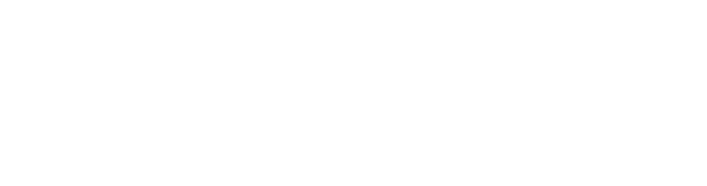

# 🕋 Makkah Crowd Management Dashboard

<div align="center">
   &nbsp;&nbsp;
  
</div>

> **Interactive AI-powered dashboard to manage and monitor crowds in Makkah during Hajj and Umrah.**  
> Built with Streamlit | YOLOv8 | Forecasting Models | QR-based Floor Control

🔗 **[Live Demo](https://your-streamlit-app-link.streamlit.app/)**  

## Team 
- 📊 Alanoudniaf@
- 📊 @janaabdulaziz
- 📊 @SARAHMALOTAIBI 
- 📊 @abraraldosari
- 📊 @3Maali

---

## 📌 About the Project

The Makkah Crowd Management Dashboard is designed to **enhance safety and efficiency** during Hajj and Umrah by using real-time detection and predictive analytics. It enables authorities to:

- 🔮 Forecast crowd density for 7 days
- 📹 Detect real-time crowd levels using YOLOv8
- 📱 Manage floor access using QR codes
- 📊 Generate and export pilgrim movement reports (CSV/PDF)
- 💬 Support pilgrims via a Telegram chatbot
- 📺 View surveillance or recorded crowd videos
- 📍 Plan and allocate crowd control resources effectively

---

## 🧰 Technologies Used

- **Backend & App**: Python 3.8+, Streamlit
- **Data Analysis**: Pandas, NumPy
- **Visualization**: Plotly
- **Computer Vision**: OpenCV, Ultralytics YOLOv8
- **QR & Security**: `qrcode`, `cryptography` (Fernet)
- **File Exporting**: FPDF
- **Database**: SQLite
- **Others**: os, json, uuid, logging

---

## 🚀 How to Use

1. **Visit the App**  
   👉 [Live Dashboard](https://your-streamlit-app-link.streamlit.app/)

2. **Navigate Through Tabs**
   - **Crowd Prediction**: Generate and view crowd forecasts on a map.
   - **Control Center**: Watch live or recorded videos with real-time detection.
   - **Floor Management**: Scan and generate QR codes for entry/exit control.
   - **Reports**: Download daily movement summaries in CSV/PDF.
   - **FAQ**: Chat with the AI assistant or use the Telegram bot.

3. **Sidebar Settings**
   - Set thresholds and customize detection preferences.

---

## 🎯 Example Use Cases

- **Forecasting**: Predict crowd levels in Tawaf and Saei for the coming 7 days.
- **Live Detection**: Use webcam/video feed to monitor current density.
- **QR Control**: Scan a QR to allow or deny access to specific floors.
- **Reports**: Export logs showing 50 entries and 30 exits from the First floor.

---

## 🧠 Model Architecture

### 📈 Crowd Forecasting
- **Type**: Time Series Forecasting (see `real.py`)
- **Data**: Historical footfall data
- **Output**: 7-day forecast with categories: Low / Medium / High

### 🧍 Real-Time Detection
- **Model**: `yolov8s-seg` (segmentation)
- **Task**: Detect people and compute coverage %
- **Pipeline**: Frame resize → crop → detection → confidence thresholding
- **Performance**: Real-time (adjustable confidence and IOU)

---

## ⚙️ Setup Instructions

```bash
# 1. Clone the repo
git clone https://github.com/your-username/makkah-crowd-management.git
cd makkah-crowd-management

# 2. Create and activate virtual environment
python -m venv venv
source venv/bin/activate  # On Windows: venv\Scripts\activate

# 3. Install dependencies
pip install -r requirements.txt

# 4. Prepare required assets
#   - Place videos in: videos/
#   - Ensure these files are in the root:
#       - sda_sda.png
#       - lewagon_logo.png
#       - team.png

# 5. Run the Streamlit app
streamlit run app.py
